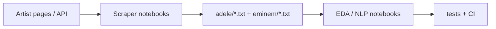
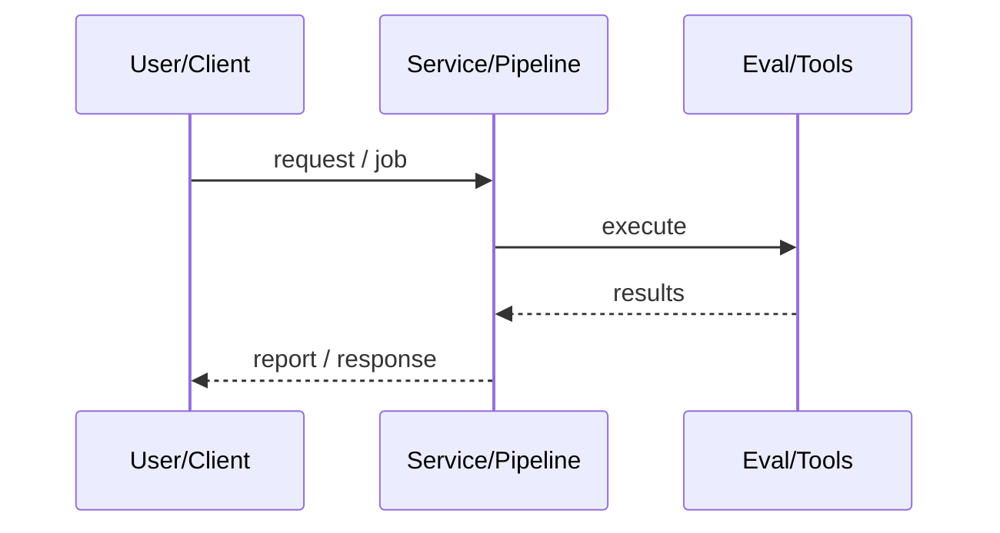
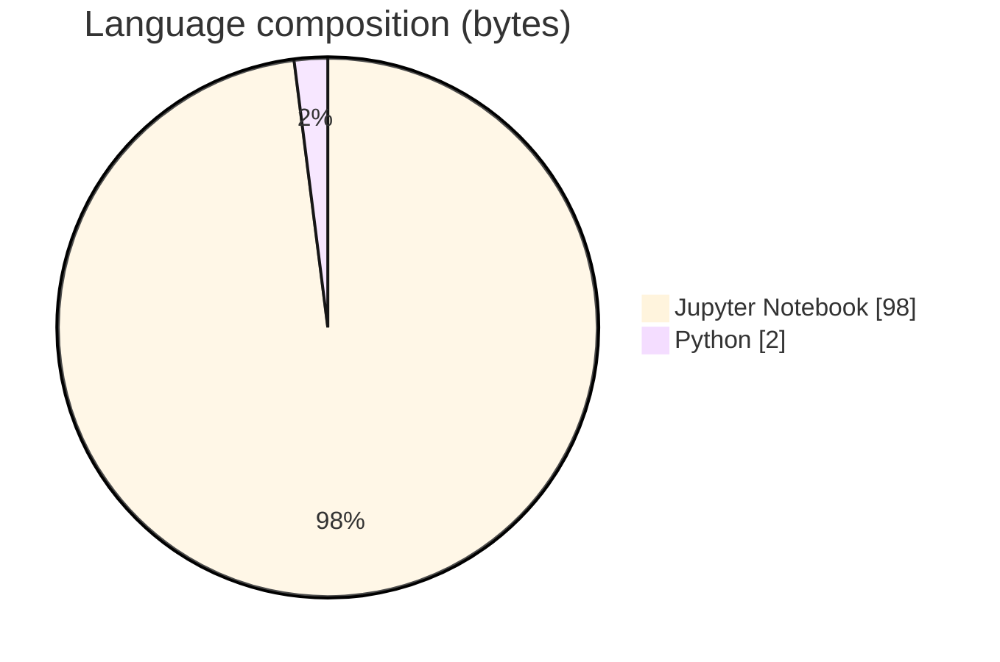

# ADS 509 Lyrics Data Acquisition via Scraping

### Scrape and organize artist lyrics corpora for applied text-mining coursework.

[](https://github.com/ArchanaChetan07/ADS-509-Data-Acquisition-with-APIs-and-Scraping)
[](https://github.com/ArchanaChetan07/ADS-509-Data-Acquisition-with-APIs-and-Scraping)
[](https://github.com/ArchanaChetan07/ADS-509-Data-Acquisition-with-APIs-and-Scraping)
[](https://github.com/ArchanaChetan07/ADS-509-Data-Acquisition-with-APIs-and-Scraping/actions)

---

## Overview

Need reproducible acquisition of lyrics text (Adele and Eminem) with API/scraping patterns for ADS 509 Applied Text Mining.

Jupyter notebooks (Lyrics.ipynb, Lyrics_Scraper_Project.ipynb) use requests/BeautifulSoup-style scraping and store song text under artist/all and artist/decades folders; pytest smoke tests under tests/.

A structured lyrics corpus (Adele + Eminem, decade partitions) plus requirements for pandas, BeautifulSoup, requests, seaborn, wordcloud, and scikit-learn.

This repository is maintained as **production-minded portfolio work**: clear architecture, automated checks where present, and metrics that are **traceable to committed artifacts** (never invented).

---

## Architecture

Artist target URLs → scrape/download lyrics → write .txt under artist/all and decade folders → optional EDA/NLP in notebooks → CI test smoke checks.





---

## Results & repository facts

> Only values found in code, configs, tests, or generated reports are listed. Absence of a clinical/ML accuracy number means it was **not** published in-repo.

| Metric | Value | Source |
|---|---|---|
| Tracked repository files | **167** | `git tree (default branch)` |
| Notebooks | **2** | `Lyrics.ipynb; Lyrics_Scraper_Project.ipynb` |
| Lyrics text files | **161** | `adele/**/*.txt; eminem/**/*.txt` |
| Tracked files | **167** | `git tree` |
| Python modules | **1** | `git tree` |
| Test-related paths | **1** | `git tree` |
| CI workflows | **Yes** | `.github/workflows` |
| Docker present | **No** | `repo root` |



---

## Key features

- Lyrics scraper notebooks for two artists
- Corpus organized as artist/all and artist/decades/*.txt
- EDA tooling (wordcloud, seaborn)
- CI workflow and unit test stub

---

## Tech stack

| Layer | Technology |
|---|---|
| language | Python |
| notebooks | Jupyter |
| scraping | BeautifulSoup4 |
| http | requests |
| data | pandas |
| viz | matplotlib |
| viz | seaborn |
| viz | wordcloud |
| ml | scikit-learn |
| ci | GitHub Actions |

---

## Skills demonstrated

Jupyter Notebook · p · a · n · d · s · CI/CD · testing · automation

Keyword surface: **Python · Jupyter Notebook · machine-learning · CI/CD · testing · API · Docker · automation · data-science · software-engineering · system-design · observability · LLM · cloud**

---

## Project structure

```text
ADS-509-Data-Acquisition-with-APIs-and-Scraping/
├── Lyrics.ipynb
├── Lyrics_Scraper_Project.ipynb
├── requirements.txt
├── adele/{all,decades/...}/*.txt
├── eminem/{all,decades/...}/*.txt
├── tests/test_data_acquisition.py
└── .github/workflows/ci.yml
```

---

## Installation & usage

```bash
git clone https://github.com/ArchanaChetan07/ADS-509-Data-Acquisition-with-APIs-and-Scraping.git
cd ADS-509-Data-Acquisition-with-APIs-and-Scraping
pip install -r requirements.txt
jupyter notebook Lyrics_Scraper_Project.ipynb
```

---

## How it works

Notebooks scrape or collect lyrics into per-song text files grouped by artist and decade, then use pandas/visualization libraries for exploratory analysis typical of ADS 509 assignments.

---

## Future improvements

- Document original scrape targets and rate limits
- Replace template README with assignment-specific setup and ethics notes
- Add a single CLI entrypoint for re-scraping

---

## License

See repository.

---

<p align="center">
  <b>ADS 509 Lyrics Data Acquisition via Scraping</b><br/>
  <a href="https://github.com/ArchanaChetan07/ADS-509-Data-Acquisition-with-APIs-and-Scraping">github.com/ArchanaChetan07/ADS-509-Data-Acquisition-with-APIs-and-Scraping</a>
</p>
